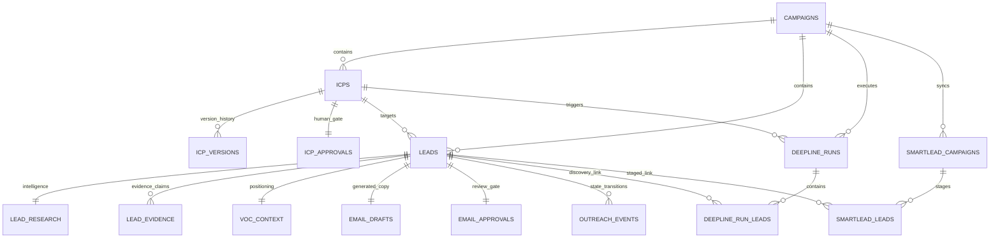

# Aedrix Cold Outreach System: Supabase PostgreSQL Primary Production Database Architecture

## 1. Executive Summary

The **Aedrix AI Cold Outreach System** uses **Supabase PostgreSQL** as its primary production database, transitioning from flat JSON storage to a normalized, high-performance, ACID-compliant relational data architecture.

### Core Architecture Principles
1. **Primary Database of Record**: Supabase PostgreSQL is the authoritative source of truth. Flat JSON files serve as cold backup and snapshot export formats.
2. **Strict Immutability & Audit Trail**: Original AI drafts (`ai_original_email_1`, `ai_original_followup_a`, `ai_original_followup_b`) and Claude-designed ICP configurations are permanently immutable. Operator edits create versioned records (`icp_versions`) and edit tracking entries while preserving the exact original AI generation.
3. **Safety Gate Invalidation**: Any operator edit of an approved ICP or email draft immediately resets approval status (`EDITED`) and revokes downstream staging/discovery eligibility (`smartlead_eligible=False` or `deepline_eligible=False`) until explicitly re-approved.
4. **Resilient Offline Fallback**: If PostgreSQL connection is unavailable or `DATABASE_ENABLED=false`, the system gracefully falls back to local JSON stores without crashing.
5. **Zero Duplicate Migrations**: Idempotent data migration scripts allow continuous re-execution without duplicate record creation.

---

## 2. Entity-Relationship Model (16 Normalized Tables)



### Table Definitions

| # | Table Name | Description | Key Indexes |
|---|---|---|---|
| 1 | `campaigns` | Campaign roots and top-level objectives | `id`, `name`, `status`, `created_at` |
| 2 | `icps` | ICP master records | `id`, `campaign_id`, `name`, `status` |
| 3 | `icp_versions` | Versioned history of ICP configs (`v1.0.0`, `v1.1.0`) | `id`, `(icp_id, version)` (UNIQUE) |
| 4 | `icp_approvals` | Human approval gate for ICP configs | `id`, `icp_id` (UNIQUE), `status`, `deepline_eligible` |
| 5 | `leads` | Core prospect data & scoring (OPI, Opp, Acc) | `id`, `campaign_id`, `icp_id`, `email`, `priority_level`, `qualification_status`, `outreach_priority_index` |
| 6 | `lead_research` | Raw intelligence, sources, pain points | `id`, `lead_id` (UNIQUE) |
| 7 | `lead_evidence` | Grounded evidence claims and verification levels | `id`, `lead_id`, `claim_type` |
| 8 | `voc_context` | Voice-of-Customer pain point & angle mappings | `id`, `lead_id` (UNIQUE) |
| 9 | `email_drafts` | AI original drafts & operator edited copy | `id`, `lead_id` (UNIQUE), `qa_status` |
| 10 | `email_approvals` | Human approval gate for outreach emails | `id`, `lead_id` (UNIQUE), `approval_status`, `smartlead_eligible` |
| 11 | `deepline_runs` | Discovery runs, requested/discovered counts | `id`, `icp_id`, `campaign_id`, `created_at` |
| 12 | `deepline_run_leads` | Links discovered prospects to run batches | `id`, `run_id`, `lead_id` |
| 13 | `smartlead_campaigns`| Linked Smartlead sequences & upload settings | `id`, `campaign_id`, `status` |
| 14 | `smartlead_leads` | Staged prospects and sequence custom fields | `id`, `smartlead_campaign_id`, `lead_id` |
| 15 | `audit_logs` | Immutable audit log of all system & human actions| `id`, `(entity_type, entity_id)`, `created_at` |
| 16 | `outreach_events` | State machine events (opens, replies, bounces) | `id`, `(lead_id, occurred_at)`, `event_type` |

---

## 3. Database Connection & Pool Configuration

The connection layer is implemented in [`src/database/connection.py`](file:///c:/Users/marja/.gemini/antigravity/scratch/aedrix-outreach-poc-python/src/database/connection.py) using **SQLAlchemy 2.x** with the **`psycopg` (v3)** PostgreSQL driver.

### Connection Parameters
- **Pool Pre-Ping**: `pool_pre_ping=True` (Validates active connection before checking out of pool).
- **Pool Size**: `pool_size=10`, `max_overflow=20`.
- **Pool Recycle**: `pool_recycle=300` (Recycles idle connections every 5 minutes to prevent stale Supabase connection timeouts).
- **Connection Timeout**: `connect_timeout=10` (Fails fast if network unreachable).

---

## 4. API Endpoints & Health Check

### Health Check Endpoint
- **URL**: `GET /api/system/database-health`
- **Response Format**:
  ```json
  {
    "database": "supabase_postgresql",
    "connected": true,
    "latency_ms": 28.4,
    "database_enabled": true,
    "status": "HEALTHY"
  }
  ```

---

## 5. Migration & Backup Utilities

### Idempotent JSON-to-PostgreSQL Migration
To seed or synchronize Supabase PostgreSQL from local JSON data:
```powershell
.venv\Scripts\python src/database/migrate_json_to_db.py
```
- **Idempotent**: Can be run repeatedly; creates 0 duplicate records.

### Database to JSON Backup Exporter
To export a complete snapshot of all PostgreSQL tables into timestamped JSON backup archives:
```powershell
.venv\Scripts\python scripts/export_db_to_json.py
```
- Exports to `data/backups/backup_{YYYYMMDD_HHMMSS}/` containing `campaigns.json`, `icp_approval_queue.json`, `leads.json`, `approval_queue.json`, `deepline_runs.json`, and `audit_logs.json`.

---

## 6. Alembic Schema Migrations

Alembic manages incremental schema migrations:
- **Migration Location**: `alembic/versions/`
- **Run Migrations**:
  ```powershell
  .venv\Scripts\alembic upgrade head
  ```
